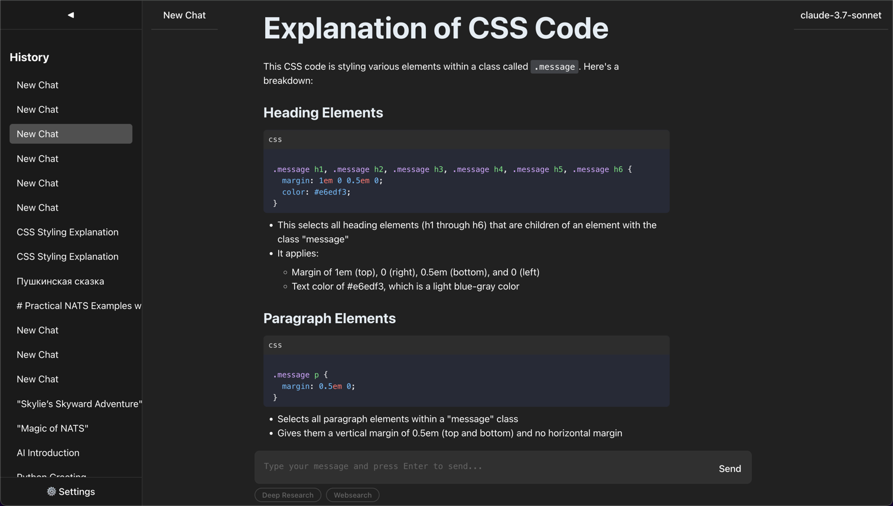

# LLM Chat UI

A modern chat interface for Large Language Models (LLMs) built with React, TypeScript, and Vite.



## Features

- Clean and intuitive chat interface
- Model selection capability
- Real-time chat interactions
- Markdown support with syntax highlighting
- Settings configuration through modal window
- Responsive sidebar for chat management

## Tech Stack

- React 19
- TypeScript
- Vite 6
- Markdown rendering with markdown-to-jsx
- Syntax highlighting via starry-night
- Modern ESLint configuration

## Getting Started

### Prerequisites

- Node.js (Latest LTS version recommended)
- npm or yarn package manager

### Installation

1. Clone the repository:
```bash
git clone https://github.com/valaises/llm-chat.git
cd llm-chatui
```

2. Install dependencies:
```bash
npm install
```

### Development

To start the development server:

```bash
npm run dev
```

This will start the Vite development server with hot module replacement.

### Building for Production

To create a production build:

```bash
npm run build
```

The built files will be in the `dist` directory.

### Preview Production Build

To preview the production build locally:

```bash
npm run preview
```

## Docker Support

This project includes Docker and Docker Compose configurations for both development and production environments.

### Using Docker for Development

To start the development environment with host network mode:

```bash
docker-compose up app-dev
```

This will start the Vite development server using the host's network, making it available on port 5173 with hot module replacement enabled.

If you prefer using port mapping instead of host network:

```bash
docker-compose --profile ports up app-dev-ports
```

### Using Docker for Production

To build and run the production version with host network mode:

```bash
docker-compose up app-prod
```

This will build the application and serve it using Nginx, making it available directly on the host's port 80.

If you prefer using port mapping instead of host network:

```bash
docker-compose --profile ports up app-prod-ports
```

### Building Docker Images Manually

To build the Docker image manually:

```bash
# For production
docker build -t llm-chatui:latest .

# For development
docker build -t llm-chatui:dev -f Dockerfile.dev .
```

### Running Docker Containers Manually

```bash
# Run production container
docker run -p 80:80 llm-chatui:latest

# Run development container
docker run -p 5173:5173 -v $(pwd):/app -v /app/node_modules llm-chatui:dev
```

## Project Structure

The project is organized into several key directories:

- **src/**: Contains the main application code, including components, hooks, and utilities.
- **public/**: Holds static assets such as images and the main HTML file.
- **tests/**: Includes unit and integration tests for the application.
- **dist/**: The output directory for production builds.
- **.github/**: Contains GitHub-specific files, including workflows for CI/CD.
